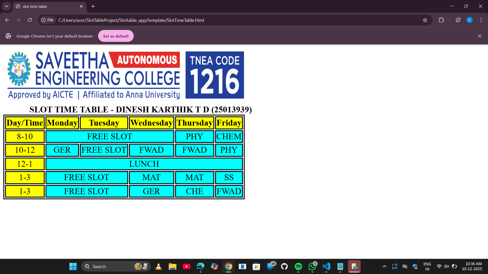

# Ex02 Time Table
## Date:10/12/2025

## AIM
To write a html webpage page to display your slot timetable.

## ALGORITHM
### STEP 1
Create a Django-admin Interface.

### STEP 2
Create a static folder and inert HTML code.

### STEP 3
Create a simple table using ```<table>``` tag in html.

### STEP 4
Add header row using ```<th>``` tag.

### STEP 5
Add your timetable using ```<td>``` tag.

### STEP 6
Execute the program using runserver command.

## PROGRAM
```
<!doctype html>
<html>
<head>
<title>	slot time table </title>
<style>
table,th,td
{ 
border: 2px double;
text-align:center
}
#clr
{
background-color:yellow
}
</style>
</head>
<body>
<br>
&nbsp &nbsp &nbsp &nbsp &nbsp &nbsp <b> SLOT TIME TABLE - DINESH KARTHIK T D (25013939)</b>
<table>
<thead>
<tr style="background-color:yellow">
<th>Day/Time</th>
<th>Monday</th>
<th>Tuesday</th>
<th>Wednesday</th>
<th>Thursday</th>
<th>Friday</th>
</tr>
</thead>

<tbody style="background-color:aqua">

<tr>
<td id="clr">8-10</td>
<td colspan=3>FREE SLOT</td>
<td>PHY</td>
<td>CHEM</td>
</tr>

<tr>
<td id="clr">10-12</td>
<td>GER</td>
<td>FREE SLOT</td>
<td>FWAD</td>
<td>FWAD</td>
<td>PHY</td>
</tr>

<tr>
<td id="clr">12-1</td>
<td colspan=5>LUNCH</td>
</tr>

<tr>
<td id="clr">1-3</td>
<td colspan=2>FREE SLOT</td>
<td>MAT</td>
<td>MAT</td>
<td>SS</td>
</tr>

<tr>
<td id="clr">1-3</td>
<td colspan=2>FREE SLOT</td>
<td>GER</td>
<td>CHE</td>
<td>FWAD</td>
</tr>


</tbody>
</body>

</html>

```

## OUTPUT



## RESULT
The program for creating slot timetable using basic HTML tags is executed successfully.


